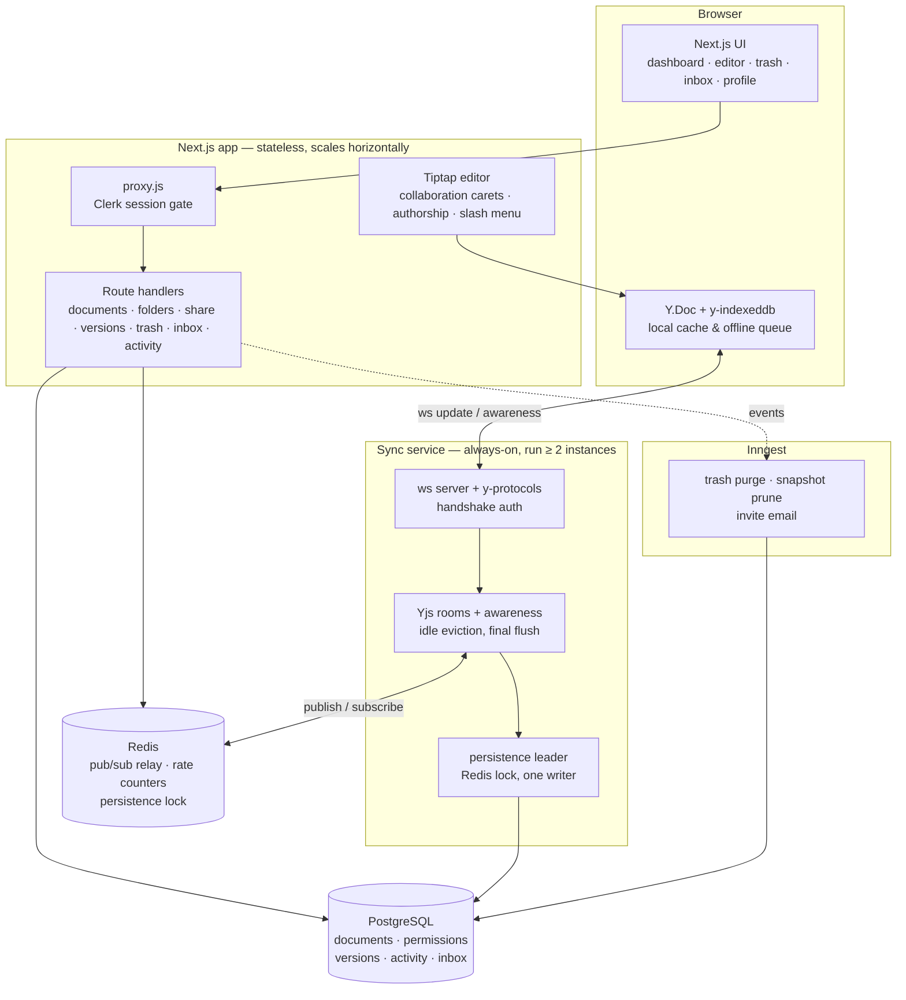

<div align="center">

# Inkwell

**Write together, in real time.**

A self-hostable, real-time collaborative document platform. Multiple people write in the
same paragraph at the same instant and **Yjs CRDTs merge every keystroke** — no conflicts,
no overwrites, no lost work.

[](https://nextjs.org)
[](https://react.dev)
[](https://yjs.dev)
[](https://prisma.io)
[](https://postgresql.org)
[](https://redis.io)
[](https://tailwindcss.com)
[](https://clerk.com)
[](https://vitest.dev)
[](docker-compose.yml)
[](#license)

</div>

---

## 🎬 Launch video

A 22.9-second launch film for this project was produced with the [`brag`](.agents/skills/brag/SKILL.md)
skill and Hyperframes. It opens on two coloured carets typing
*"Write together, in real time."* into the same line at once, then walks the real user flow:
dashboard → open a document → two people editing one paragraph → the merged sentence →
sharing and permissions.

```text
brag-output/
  brag.mp4              22.9s · 1920x1080 · 30fps · H.264/AAC
  brag.jpg              poster frame (baked as frame 0 — the idle thumbnail everywhere)
  share-copy.txt        the caption to post with it
  brag-plan.md          storyboard and creative contract
  composition-brief.md  the Hyperframes handoff brief
  composition/          the Hyperframes project that renders it
```

`brag-output/` is gitignored (it holds a rendered binary), so clone-and-run will not
contain it — regenerate with `npx hyperframes render` inside `brag-output/composition`.

---

## Contents

- [What Inkwell is](#what-inkwell-is)
- [Architecture](#architecture)
- [Feature tour](#feature-tour)
- [Permission model](#permission-model)
- [The wire contract](#the-wire-contract)
- [Security model](#security-model)
- [The parts that are easy to get wrong](#the-parts-that-are-easy-to-get-wrong)
- [Tech stack](#tech-stack)
- [Design system](#design-system)
- [Quick start](#quick-start)
- [Full local stack (Docker)](#full-local-stack-docker)
- [Environment variables](#environment-variables)
- [npm scripts](#npm-scripts)
- [Testing](#testing)
- [Project structure](#project-structure)
- [CI](#ci)
- [Deployment](#deployment)
- [Roadmap](#roadmap)

---

## What Inkwell is

Most "collaborative" editors are last-write-wins with a lock. Inkwell is the other kind:
documents are **CRDTs**, so two people typing into the same sentence at the same
millisecond produce the same merged result on every client, in every order, with no
coordination and no chair. The editor shows whose characters are whose, where their
carets are, and what the document looked like an hour ago.

It is designed to run on infrastructure you own:

- the **Next.js app** handles UI, CRUD, sharing, and background jobs,
- the **WebSocket sync service** is a separate always-on process that owns live
  document rooms,
- both share one Postgres database and one Redis, and both enforce the same permissions.

Nothing is delegated to a hosted collaboration vendor. Guests can be invited by link and
never need an account; offline edits survive a lost connection and merge on reconnect.

---

## Architecture

Inkwell splits into **two deployables** that are independent processes, container images,
and `package.json` files — sharing a database, a Redis, and one wire contract.



| Runtime | Location | Responsibility |
|---|---|---|
| **Next.js app** | `src/` | UI, CRUD API routes, sharing & permissions, folders, auth, version history API, Inngest handler, error reporting |
| **Sync service** | `sync-service/` | Live Yjs rooms, awareness/presence, Redis cross-instance relay, snapshot persistence, idle-room eviction |
| **Shared contract** | `shared/` | The wire protocol, role hierarchy, rate-limit primitives, timing-safe compare — imported by **both** runtimes by relative path |

`shared/` exists because the two runtimes ship separately and used to carry duplicated
constants with *"cross-reference: keep in sync"* comments. They now import one module, and
`tests/shared-protocol.test.js` plus `tests/schema-drift.test.js` fail the build if the
sync service's raw SQL and Prisma's schema ever disagree.

---

## Feature tour

### Real-time co-editing
Yjs CRDTs merge concurrent edits conflict-free at the character level. Edits propagate
across horizontally-scaled sync instances in **under 300ms** via a per-document Redis
pub/sub channel, so every participant converges on the same state no matter which
instance they landed on.

### Live presence and authorship
Every collaborator gets a stable colour from an eight-colour palette
(`#0ea5e9 #8b5cf6 #ec4899 #f59e0b #10b981 #ef4444 #6366f1 #14b8a6`). Carets carry name
pills, remote selections render as translucent bands, an avatar stack in the header shows
who is in the document, an `Editors` rail names them, and a connection pill reports
`Live` / `Connecting…` / `Reconnecting…` / `Offline — edits saved locally`.

**Authorship runs** underline the text each person contributed, coloured by author —
and are stripped in `@media print`.

### Sharing and permissions
Invite by email (an Inngest job sends the mail through Resend) or switch on a public
link. Four roles are enforced **server-side on every HTTP request and every WebSocket
frame**: `OWNER > EDITOR > COMMENTER > VIEWER`. Invitees who have no account yet get a
pre-provisioned `pending_<uuid>` user row so the permission exists before their first
sign-in, and are labelled `pending` in the dialog until they claim it.

Share links use a **signed, revocable token — never the document ID** — so revoking a link
invalidates access immediately for everyone holding it.

### Document organization
Nested folders with cycle detection, move-between-folders, title search, and
`Owned by me` / `Shared with me` scopes. Documents received from someone else are read-only
in the dashboard and badge as `shared with you`.

### Version history
The sync service snapshots every document **every 5 minutes** while it is being edited.
Browse the timeline, preview any version as rendered HTML, and restore it. Restore is a
**hot-swap**: the restored snapshot is published over Redis and every connected client
receives the new state without a reload. The document's pre-restore state is written to
history first, so a restore is itself always undoable. Snapshots older than **30 days**
are pruned by a daily job.

### Trash with a 30-day window
Deleting is soft (`deletedAt` + `originalFolderId`), so restore puts the document back
where it was. An hourly Inngest job purges anything past 30 days.

### Offline editing
The editor caches documents in IndexedDB through `y-indexeddb`. Lose the connection and
the pill switches to `Offline — edits saved locally`; keep typing; the queued update
merges when the socket returns.

### Invites inbox
Email invites land in `/inbox` with denormalized display fields, so an invite still reads
correctly after the underlying document is deleted. Accepting an invite turns the pending
permission into a real one and records it in the activity log.

### Activity log and profile
Every meaningful mutation (document created/shared/restored/purged, link toggled, invite
sent/accepted) writes an `ActivityEvent`. `/profile` shows the timeline plus aggregate
stats, paginated with a cursor.

### The editor itself
Tiptap 3 with a slash menu (`/h1`, `/todo`, `/code`, `/table`, `/divider`, `/image` and
more, fuzzy-matched over titles and aliases), syntax-highlighted code blocks with a
language badge, task lists, tables with column resize, images, headings, quotes, and
markdown/HTML rendering through `@tiptap/html` + `marked`.

### Light and dark, on purpose
One warm-stone palette in two moods, with animated headings, scroll reveals, and a
parallax landing page that reintroduces the dot-grid background from the marketing site
into the product's visual language.

---

## Permission model

Roles are a total order; a capability check answers "can this role do that", and any
uncertainty resolves to **no**.

| Capability | Owner | Editor | Commenter | Viewer |
|---|:--:|:--:|:--:|:--:|
| Open the document | ✅ | ✅ | ✅ | ✅ |
| Read live content | ✅ | ✅ | ✅ | ✅ |
| Edit content | ✅ | ✅ | — | — |
| Send WebSocket updates | ✅ | ✅ | — | — |
| See presence & carets | ✅ | ✅ | ✅ | ✅ |
| Invite / change roles | ✅ | — | — | — |
| Enable or revoke a share link | ✅ | — | — | — |
| Restore a version | ✅ | ✅ | — | — |
| Delete (move to trash) | ✅ | — | — | — |

Enforced in **three** places from one definition (`shared/roles.js`,
`src/lib/permissions.js`, `sync-service/src/rooms.js`) — the API, the WebSocket handshake,
and the per-frame edit gate. A `VIEWER` that forges an update frame is rejected by the
room, not just hidden in the UI.

---

## The wire contract

`shared/protocol.js` is the single source of truth for what crosses the boundary.

**Pub/sub envelope kinds** — one Redis channel per document (`inkwell:doc:<id>`), so an
envelope can never be applied to the wrong room:

| Kind | Meaning |
|---|---|
| `update` | base64 Yjs update, applied to every instance's copy of the room |
| `awareness` | base64 awareness update (cursors, names, colours) |
| `apply-snapshot` | version-restore hot-swap |

**WebSocket close codes.** The sync service *completes* the handshake and then closes,
because a bare HTTP 403 on the upgrade never reaches the browser as a close event — the
client could not tell "refresh your token" from "stop trying":

| Code | Sent when | Client behaviour |
|---|---|---|
| `4400` | Clerk token expired | refresh the token, reconnect immediately |
| `4401` | Invalid token | terminal — explain and stop |
| `4403` | No access to this document | terminal |
| `4404` | Document not found | terminal |
| `4408` | Handshake rate limit | back off, then reconnect |

Only `4400` and `4408` are retryable (`RETRYABLE_CLOSE_CODES`). Any unmapped auth verdict
falls back to "invalid token" — denials are fail-closed, so an unknown code must never
look recoverable by accident.

---

## Security model

**Fail-closed by default.** Every permission check denies on uncertainty, including a
missing field, an unparseable role, and an unmapped auth verdict.

**404, never 403.** A stranger asking for a document they cannot see gets the same
response as a stranger asking for a document that does not exist. The E2E suite asserts
this directly, including that a *share-token guess* cannot distinguish "no document" from
"no access" — otherwise the API becomes a document-enumeration oracle.

**Share tokens are bearer credentials.** 24 random bytes, compared in constant time,
stored as a unique column, and revocable from the share dialog.

**Rate limits** live in `shared/rate-limit.js` and are used by both runtimes, so the
browser-facing API and the socket handshake cannot drift apart. Redis-backed fixed
windows, with a per-process fallback if Redis is unreachable (availability wins over
cross-instance accuracy — a Redis blip must not take down the API):

| Bucket | Key | Limit |
|---|---|---|
| `SHARE_LINK_DOC` | document | 240 / 60s |
| `SHARE_LINK_IP` | client IP | 120 / 60s |
| `WRITE` | user | 120 / 60s |
| `DOC_CREATE` | user | 30 / hour |
| `WS_HANDSHAKE` | client IP | 30 / 60s |

**Proxy headers are opt-in.** `X-Forwarded-For` is attacker-controlled when the app is
reached directly, so it is honoured only when `TRUST_PROXY=1` says a real proxy overwrites
it. Without it the share-link throttle keys by document instead — the granularity that
actually protects the secret.

**Soft delete is still auth.** A trashed document is invisible to collaborators, not just
absent from the dashboard, and `tests/trashed-doc-access.test.js` pins that.

---

## The parts that are easy to get wrong

These are the invariants this codebase deliberately spends tests on.

| Invariant | Where | Test |
|---|---|---|
| Only one sync instance persists a room at a time | Redis leader lock in `sync-service/src/rooms.js` | `persistence-lock.test.js` |
| A destroyed room flushes first, then evicts | idle reaper | `awareness-cleanup.test.js` |
| Awareness state for a departed peer is cleaned up | rooms | `awareness-cleanup.test.js` |
| A restore is undoable, and the revert delta math is exact | `ydoc-utils.js` | `restore-revert.test.js`, `version-restore-contract.test.js` |
| Snapshots are written on a 5-minute cadence, not per keystroke | `maybeCreateVersion` | `version-cadence.test.js` |
| A folder cannot be its own ancestor | folder PATCH route | `folder-cycle-detection.test.js` |
| The sync service's raw SQL still matches `prisma/schema.prisma` | schema drift guard | `schema-drift.test.js` |
| A pending invite is never rendered as accepted | `isPendingUser` + the select that must feed it | `share-collaborators.test.js` |
| Guests on a share link get a room role, not a user row | sync auth | `sync-ws-auth.test.js` |
| A `VIEWER` cannot write through the socket | per-frame edit gate | `sync-edit-gating.test.js` |

---

## Tech stack

| Layer | Choice |
|---|---|
| Framework | Next.js 16 (App Router, RSC) · React 19 |
| Realtime | Yjs 13 CRDTs · y-websocket · y-protocols · `@tiptap/y-tiptap` |
| Editor | Tiptap 3 (StarterKit, tables, images, task lists, code blocks, slash commands) |
| Persistence | PostgreSQL 15+ via Prisma 7 (`@prisma/adapter-pg`) · Yjs state as `Bytes` |
| Fan-out | Redis 7 pub/sub (per-document channels) + rate-limit counters |
| Auth | Clerk 7 session tokens, validated on every request and every socket handshake |
| Background jobs | Inngest (hourly trash purge, daily snapshot prune, invite email) |
| Email | Resend |
| Errors | Sentry (server + browser, opt-in via DSN) |
| Styling | Tailwind CSS v4 (`@theme inline`) · Radix primitives · lucide-react |
| Fonts | Outfit (UI) · JetBrains Mono (code & metadata) via `next/font` |
| Offline | `y-indexeddb` |
| Tests | Vitest (23 unit suites) · Playwright (Chromium E2E) |
| Runtime | Node.js 20+ (CI and containers pin **Node 24**) |

---

## Design system

The product is ink on paper: one warm-stone scale, one near-black, and the collaborators
supply all the colour.

| Token | Dark (product) | Light | Role |
|---|---|---|---|
| `--background` |  `#0c0a09` |  `#fafaf9` | page |
| `--card` |  `#1c1917` |  `#ffffff` | surfaces |
| `--border` |  `#292524` |  `#e7e5e4` | hairlines |
| `--foreground` |  `#fafaf9` |  `#1c1917` | ink |
| `--muted-foreground` |  `#a8a29e` |  `#78716c` | secondary ink |
| `--destructive` |  `#ef4444` |  `#dc2626` | destructive |

Collaborator palette — the only saturated colour the product introduces
(`sync-service/src/auth.js` → `colorFor`):


Typography: **Outfit** for UI and display, **JetBrains Mono** for code, timestamps, room
IDs, and URLs — the same pairing the launch video uses.

---

## Quick start

### Prerequisites

- **Node.js** 20+ (24 recommended — CI and the images pin it)
- **PostgreSQL** 15+ and **Redis** 7+ — or Docker Compose, below
- A **Clerk** application ([dashboard.clerk.com](https://dashboard.clerk.com))
- Optional: **Inngest** (background jobs), **Resend** (invite email), **Sentry** (errors)

### 1 · Install

```bash
npm install --legacy-peer-deps
npm ci --prefix sync-service      # the sync service has its own dependencies
```

### 2 · Configure

```bash
cp .env.example .env
```

Every key the app reads is listed in `.env.example`. At minimum you need
`DATABASE_URL`, the two Clerk keys, and `REDIS_URL`.

### 3 · Start infrastructure

```bash
docker compose up -d redis        # Redis on :6379
```

Postgres can come from Compose too, or from any local install. The Compose Redis ships a
health check, so `depends_on: service_healthy` genuinely waits for it.

### 4 · Set up the database

```bash
npx prisma generate    # generates the client (see npm run db:generate)
npx prisma migrate deploy   # or: npm run db:migrate  to author a new migration
```

### 5 · Run

Two processes — the web app and the sync service:

```bash
npm run dev        # Next.js on :3000
npm run dev:sync   # WebSocket sync service on :1234
```

Open <http://localhost:3000>, sign in, create a document, and open it in two browsers to
watch it merge.

> Background jobs are optional in development: without Inngest the app still runs —
> trash simply is not purged and invite emails are logged instead of sent.

---

## Full local stack (Docker)

```bash
docker compose --profile app up --build
```

| Service | Port | Why |
|---|---|---|
| `web` | `:3000` | Multi-stage Next.js image (`Dockerfile.web`, `output: 'standalone'`) |
| `sync` | `:1234` | Sync instance #1 |
| `sync2` | `:1235` | Sync instance #2 — **locally exercises the Redis cross-instance relay** |
| `redis` | `:6379` | Pub/sub, counters, persistence lock |

Running two sync instances is the point: without them you never exercise the broadcast
path that makes horizontal scaling work.

---

## Environment variables

| Variable | Description | Default |
|---|---|---|
| `DATABASE_URL` | PostgreSQL connection string | — |
| `NEXT_PUBLIC_CLERK_PUBLISHABLE_KEY` | Clerk publishable key (browser) | — |
| `CLERK_SECRET_KEY` | Clerk secret key (server) | — |
| `NEXT_PUBLIC_CLERK_SIGN_IN_URL` / `_SIGN_UP_URL` | Auth routes | `/sign-in`, `/sign-up` |
| `NEXT_PUBLIC_CLERK_SIGN_IN_FALLBACK_REDIRECT_URL` / `_SIGN_UP_…` | Post-auth landing | `/documents` |
| `NEXT_PUBLIC_SYNC_WS_URL` | Public WebSocket URL for the sync service | `ws://localhost:1234` |
| `SYNC_PORT` | Port the sync service listens on | `1234` |
| `REDIS_URL` | Redis connection string | `redis://localhost:6379` |
| `TRUST_PROXY` | Set to `1` **only** when a trusted proxy overwrites `X-Forwarded-For` | unset |
| `INNGEST_EVENT_KEY` / `INNGEST_SIGNING_KEY` | Inngest credentials | unset (jobs disabled) |
| `RESEND_API_KEY` / `EMAIL_FROM` | Invite email delivery | unset (logged instead) |
| `SENTRY_DSN` / `NEXT_PUBLIC_SENTRY_DSN` | Error reporting (server / browser) | unset (console only) |
| `SENTRY_ENVIRONMENT` / `NEXT_PUBLIC_SENTRY_ENVIRONMENT` | Report labels — Sentry is only initialised when a DSN is set | `""` |
| `SENTRY_TRACES_SAMPLE_RATE` / `NEXT_PUBLIC_SENTRY_TRACES_SAMPLE_RATE` | Trace sampling, `0` = off | `0.1` |
| `NEXT_PUBLIC_APP_URL` | Public origin used to build share and invite links | `http://localhost:3000` |
| `E2E_PORT` / `E2E_BASE_URL` / `E2E_SERVER_CMD` | Playwright overrides | `3100` |

---

## npm scripts

| Script | What it does |
|---|---|
| `npm run dev` | Next.js dev server on :3000 |
| `npm run dev:sync` | WebSocket sync service on :1234 |
| `npm run build` / `npm start` | Production build / server |
| `npm run lint` | ESLint |
| `npm test` | Vitest unit suite |
| `npm run test:e2e` | Playwright E2E (Chromium) |
| `npm run test:e2e:install` | Install the Chromium build Playwright needs |
| `npm run db:generate` | Generate the Prisma client |
| `npm run db:migrate` | Author and apply a migration |
| `npm run db:deploy` | Apply pending migrations |
| `npm run db:seed` | Seed a demo user and document |

---

## Testing

### Unit — Vitest (23 suites)

```bash
npm test
```

The suites are organised around **contracts**, not files:

- **Permissions** — role hierarchy, capability matrix, fail-closed branches
- **CRDT** — `ydoc-utils` round-trips, concurrent-edit merge guarantees, awareness cleanup
- **Sync service** — handshake auth (session *and* share-link flows), edit gating,
  handshake throttle, persistence leader lock, SQL-vs-Prisma schema drift
- **Versioning** — snapshot cadence, restore hot-swap contract, revert delta math
- **Sharing** — collaborator list & pending state, share-link access, trash access control
- **API** — activity log + stats, inbox list/read/delete/accept, throttle behaviour
- **Shared** — `shared/protocol.js` and the Redis / in-process rate-limit counters
- **Editor** — slash-command matching, authorship run collection, offline DB naming,
  open-failure classification, error reporting

### End to end — Playwright (Chromium)

```bash
npm run test:e2e
```

Three suites over the surfaces reachable without a database or a session:

- **Auth gate** — listing/creating requires a session; document routes answer **404, never
  403**; a share-token guess cannot distinguish "no document" from "no access"; the editor
  offers sign-in rather than a dead end
- **Public surface** — the landing page renders its pitch and a way in; unknown routes are
  real 404s, not the app shell
- **Share-link throttle** — a document stops accepting guesses once out of budget, and one
  exhausted document does not lock anyone out of another

The suite is **hermetic**: `e2e/support/hermetic.mjs` aborts Clerk's third-party requests
so assertions are about this codebase, and the Playwright config forces the in-process
rate limiter (`REDIS_URL=""`) so throttle counts are deterministic. It runs on :3100 so it
never fights a dev server you already have open.

---

## Project structure

```text
docssy/                          # product name: Inkwell
├── prisma/
│   ├── schema.prisma            # User · Folder · Document · Permission · VersionSnapshot
│   │                            # ActivityEvent · InboxItem · Role enum
│   └── seed.js
├── shared/                      # imported by BOTH runtimes
│   ├── protocol.js              # message kinds, channels, close codes, auth verdicts
│   ├── roles.js                 # the role hierarchy
│   ├── rate-limit.js            # fixed-window primitives + limit specs
│   └── timing-safe.js
├── src/
│   ├── app/
│   │   ├── api/                 # documents · folders · share · versions · trash · inbox
│   │   │                        # activity · onboarding · profile · inngest
│   │   ├── documents/[id]/      # the editor page (+ loading / not-found states)
│   │   ├── documents/           # dashboard
│   │   ├── trash/  inbox/  profile/
│   │   ├── sign-in/[[...sign-in]]/ · sign-up/[[...sign-up]]/
│   │   ├── layout.js            # ClerkProvider · fonts · theme
│   │   ├── page.js              # landing page
│   │   ├── error.js · global-error.js · not-found.js · loading.js
│   │   └── globals.css          # design tokens, editor surface, caret & authorship styles
│   ├── components/
│   │   ├── editor/              # collab-editor · editor-client · presence bar
│   │   │                        # cursor legend · slash command · authorship runs
│   │   ├── documents/           # dashboard · share dialog · version history
│   │   ├── inbox/  ui/          # Radix-based primitives
│   │   └── parallax-hero · animated-heading · animated-background · typewriter-heading
│   ├── lib/                     # auth · permissions · prisma · redis · rate-limit
│   │                            # activity · inbox · ydoc-utils · offline-docs
│   │                            # error-reporting · telemetry · mappers
│   ├── inngest/                 # functions.js (purge, prune) · invite.js
│   └── proxy.js                 # Clerk middleware (Next.js 16 renamed middleware)
├── sync-service/
│   ├── src/
│   │   ├── server.js            # HTTP + WebSocket server
│   │   ├── auth.js              # Clerk JWT + share-link handshake, colour assignment
│   │   ├── rooms.js             # Yjs rooms, awareness, leader-locked persistence
│   │   ├── broadcast.js         # Redis pub/sub relay
│   │   ├── db.js                # raw pg queries (pinned by schema-drift test)
│   │   ├── rate-limit.js        # handshake throttle
│   │   └── env.js · log.js · telemetry.js
│   └── package.json
├── tests/                       # 23 Vitest suites
├── e2e/                         # Playwright suites + hermetic support
├── docker-compose.yml           # redis (+ optional app profile: web, sync, sync2)
├── Dockerfile.web               # multi-stage standalone Next.js image
└── .github/workflows/ci.yml     # verify + e2e jobs
```

---

## CI

`.github/workflows/ci.yml` runs two jobs on every push and PR to `main`:

**`verify`** — install (app + sync service), `prisma generate`, unit tests, lint, build.
Two deliberate details: the runner is pinned to **Node 24** so CI cannot pass on a runtime
the images never use, and a guard fails the build if Vitest reports *"No test files found"*
— otherwise a `.gitignore` mistake would turn the suite green and silent.

**`e2e`** — spins up a throwaway **Postgres 16** service, applies migrations, builds, then
runs Playwright against `next start` (not `next dev`, so no per-route compile on first
hit). The Playwright report is uploaded on failure. The Clerk keys are format-valid
placeholders, because `ClerkProvider` rejects a malformed publishable key at render time
and the build would then fail for a reason unrelated to the change under review.

---

## Deployment

| Component | Recommended host | Why |
|---|---|---|
| Next.js app | Vercel | Native Next.js hosting, serverless auto-scaling |
| Sync service | Railway / Fly.io | Needs an always-on process for WebSockets — not serverless |
| PostgreSQL | Neon | Serverless Postgres |
| Redis | Upstash | Serverless pub/sub and counters |
| Background jobs | Inngest | Durable crons (trash purge, snapshot prune) + event-driven invite mail |

Run the sync service with **≥ 2 instances** behind a load balancer. The Redis relay keeps
rooms converged across them, and the persistence leader lock keeps exactly one writer;
with a single instance you get none of that exercised in production either.

Set `TRUST_PROXY=1` on Vercel/Fly/Railway so share-link throttling can key by client IP.
Leave it unset when the app is reached directly — the header is attacker-controlled there.

---

## Roadmap

- **Comment threads** — the `COMMENTER` role exists and is enforced; anchored
  conversations are the missing half
- **Presence in the dashboard** — show which documents have someone in them right now
- **Snapshot diffing** — compare two versions instead of previewing one
- **Object storage for images** — the editor currently prompts for an image URL
- **Public read-only publishing** — a link that renders a document outside the app shell
- **More E2E depth** — multi-client sync and permission boundaries against a real database

---

## License

Private project. All rights reserved.
